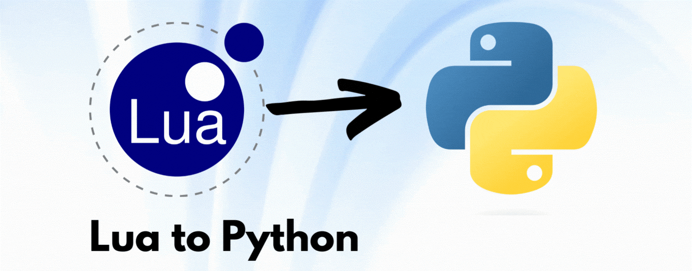

# Smart Summaries

[](https://github.com/jayrajmulani/group2-se-homeworks/blob/main/LICENSE)
[](https://www.python.org/downloads/release/python-3100/)
[](https://github.com/jayrajmulani/group2-se-homeworks/actions/workflows/auto-test.yml)
[](https://app.travis-ci.com/github/jayrajmulani/group2-se-homeworks/pull_requests)

[](https://github.com/jayrajmulani/group2-se-hw1/graphs/contributors) 
<!-- [](https://zenodo.org/badge/latestdoi/532305928) -->

Python scripts for creating Smart Summaries for CSV files by translating a lua system to python.

## Table of Contents

1. [Background](#background)
2. [Getting started](#getting-started)
3. [File and function mapping](#file-and-function-mapping)
4. [License](#license)
5. [Contributors](#contributors)

## Background

Lua is a powerful programming language with several salient features like:

- Lightweight : Because of the small number of core libraries required
- Fast : As it is mapped to C in many ways, the execution of Lua codes are very fast
- Flexible : Lua is a very versatile programming language as well

Lua has been in use in several prominent sites on the internet such as alibaba.com and roblox.

This repo aims to convert a sample code in Lua to Python, preserving the core logic of the code. 

## Getting Started

### Pre-requisites

Ensure python is installed. You can check the version of python in the system using:

``` bash
python --version
```

Check if pip is installed. This can be done with the command:

``` bash
pip --version
```

The csv file can be accessed in the [Data folder](./data/file.csv)

### Installation

Clone this repository using

``` bash
git clone https://github.com/jayrajmulani/group2-se-homeworks.git
```

You can download all the dependencies required to run the file using:

``` bash
pip install -r requirements.txt
```


## File and function mapping

The implementations for `Num`, `Sym`, `Cols`, `Row` and `Data` classes are done in this repo.

The scripts for test cases `the`, `sym`, `num`, `bignum`, `eg.csv`, `eg.data` and `eg.stats` are also prepared [here](./tests/tests.py). A custom test engine has also been developed to run the test cases.

The Lua classes and corresponding python implementation scripts are listed below:

Class         | Corresponding python script
------------- | -------------
Num           | [Num](./code/num.py)
Sym           | [Sym](./code/sym.py)
Cols          | [Cols](./code/cols.py)
Row           | [Row](./code/row.py)
Data          | [Data](./code/data.py)

## License

This project is licensed under [MIT](https://mit-license.org/).

Further details regarding the license can be found [here](https://github.com/jayrajmulani/group2-se-homeworks/blob/main/LICENSE).

## Contributors

- [Jayraj Mulani](https://github.com/jayrajmulani)
- [Yashasya Shah](https://github.com/Yashasya)
- [Harshil Sanghvi](https://github.com/Harshil47)
- [Dhrumil Shah](https://github.com/Dhrumil0310)
- [Anisha Chazhoor](https://github.com/anishasc99)
